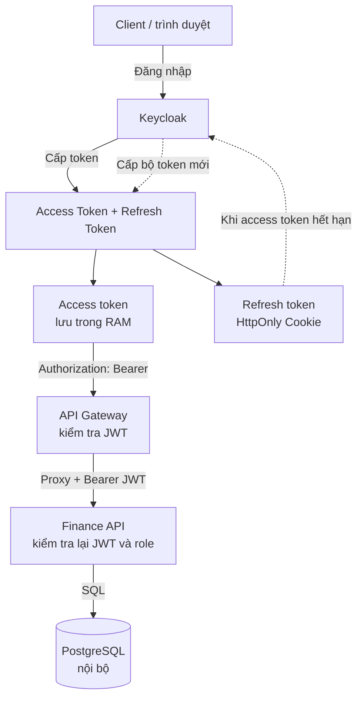
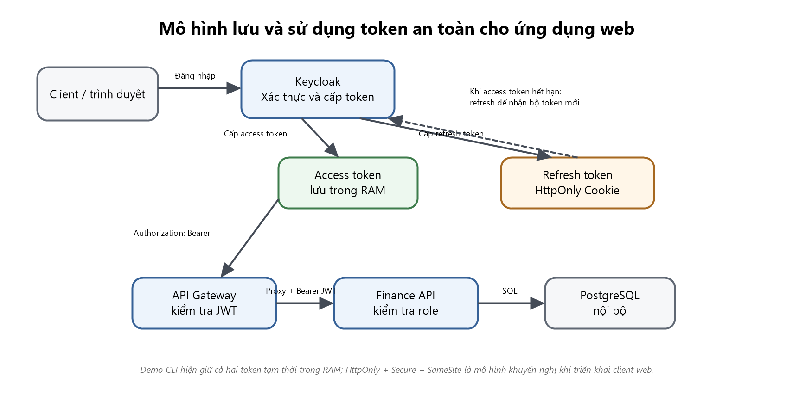
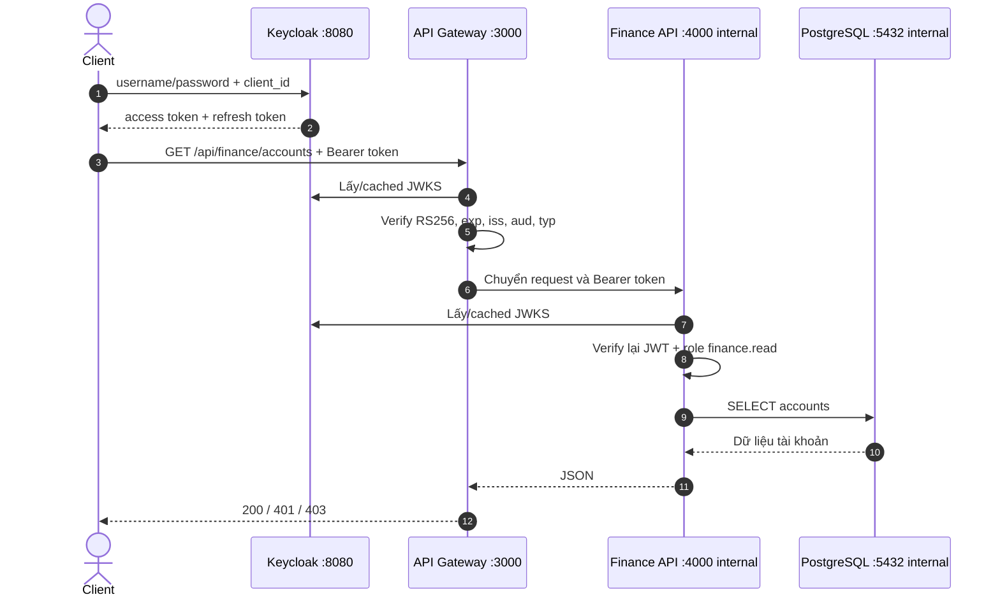
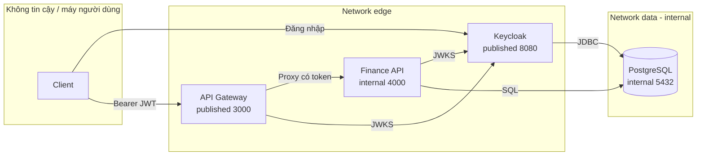

# Thiết kế demo JWT Finance

Tài liệu này mô tả phần thiết kế có thể kiểm chứng trực tiếp từ demo. Đây không phải báo cáo lý thuyết 15–25 trang.

## 1. Mô hình cấp, lưu và sử dụng token

Mô hình dưới đây là phương án khuyến nghị khi demo được phát triển thành ứng dụng web. Access token có vòng đời ngắn được giữ trong RAM và gửi qua header `Authorization: Bearer`. Refresh token được bảo vệ bằng cookie `HttpOnly`, kết hợp `Secure` và `SameSite`, rồi chỉ dùng với Keycloak để xin bộ token mới khi access token hết hạn.

Demo hiện tại là CLI PowerShell, chưa có client web và chưa thiết lập cookie trình duyệt. Vì vậy, trong các script kiểm thử, cả access token và refresh token chỉ tồn tại tạm thời trong biến RAM của tiến trình. Sơ đồ trên mô tả cách lưu token khi mở rộng demo thành ứng dụng web, không mô tả sai rằng script hiện tại đã sử dụng cookie.

## 2. Luồng kiểm tra token trong demo hiện tại

Gateway kiểm tra JWT ở biên. Finance API kiểm tra lại token và role để tạo lớp phòng thủ thứ hai nếu request nội bộ bị gửi sai hoặc Gateway bị bypass trong một môi trường khác.

## 3. Docker network và trust boundary

`edge` cho phép Gateway gọi Finance API và cả hai dịch vụ lấy JWKS từ Keycloak. `data` được đánh dấu `internal: true`; chỉ PostgreSQL, Keycloak và Finance API tham gia. Gateway không tham gia `data`, vì vậy không có đường mạng trực tiếp tới PostgreSQL.

## 4. Container, image, cổng, volume và network

| Service | Image | Cổng host | Cổng nội bộ | Volume | Network |
|---|---|---:|---:|---|---|
| `api-gateway` | `jwt-finance-demo/api-gateway:1.0.0`, nền `node:22.23.2-alpine` | 3000 | 3000 | Không | `edge` |
| `finance-api` | `jwt-finance-demo/finance-api:1.0.0`, nền `node:22.23.2-alpine` | Không | 4000 | Không | `edge`, `data` |
| `keycloak` | `quay.io/keycloak/keycloak:26.7.3` | 8080 | 8080 | Realm JSON read-only | `edge`, `data` |
| `postgres` | `postgres:17.11-alpine` | Không | 5432 | `jwt-demo-postgres-data`, init SQL read-only | `data` |

## 5. Ma trận giao tiếp

| Nguồn | Đích | Cho phép | Lý do |
|---|---|---:|---|
| Client | Keycloak | Có | Đăng nhập, nhận và làm mới token |
| Client | API Gateway | Có | Điểm vào duy nhất của Finance API |
| Client | Finance API | Không | Finance API không publish cổng host |
| Client | PostgreSQL | Không | Database không publish cổng host |
| API Gateway | Keycloak | Có | Lấy JWKS để xác minh chữ ký |
| API Gateway | Finance API | Có | Chuyển tiếp request đã qua kiểm tra JWT |
| API Gateway | PostgreSQL | Không | Gateway không thuộc network `data` |
| Finance API | Keycloak | Có | Tự xác minh lại JWT qua JWKS |
| Finance API | PostgreSQL | Có | Đọc dữ liệu tài khoản |
| Keycloak | PostgreSQL | Có | Lưu realm, user, client và session |

## 6. Kiểm soát an toàn có trong demo

- Chỉ chấp nhận thuật toán `RS256`.
- Kiểm tra `iss`, `aud`, `exp` và loại token tại hai lớp.
- RBAC bằng realm role `finance.read`.
- Access token sống 30 giây.
- Bật refresh-token rotation với `revokeRefreshToken=true`, `refreshTokenMaxReuse=0`.
- Có endpoint logout để demo thu hồi phiên.
- PostgreSQL và Finance API không public ra host.
- Network dữ liệu là network nội bộ.
- Container Node chạy bằng user `node`, filesystem read-only, bỏ Linux capabilities và bật `no-new-privileges`.
- Config import và init SQL được mount read-only.
- Secret hạ tầng lấy từ `.env`; bài nộp chỉ chứa `.env.example` với giá trị giả lập.
- Image và dependency được ghim phiên bản/lockfile.

## 7. Giới hạn có chủ đích

- Keycloak chạy `start-dev` và HTTP để demo trên localhost.
- Password grant được bật để script kiểm thử tự động lấy token; ứng dụng production nên dùng Authorization Code + PKCE cho người dùng tương tác.
- PostgreSQL dùng chung một tài khoản hạ tầng trong lab để việc khởi tạo ngắn gọn. Production phải tách account và quyền tối thiểu cho Keycloak và Finance API.
- Không lưu access token trong source, URL hoặc log. Script chỉ giữ token trong biến tiến trình rồi kết thúc.
